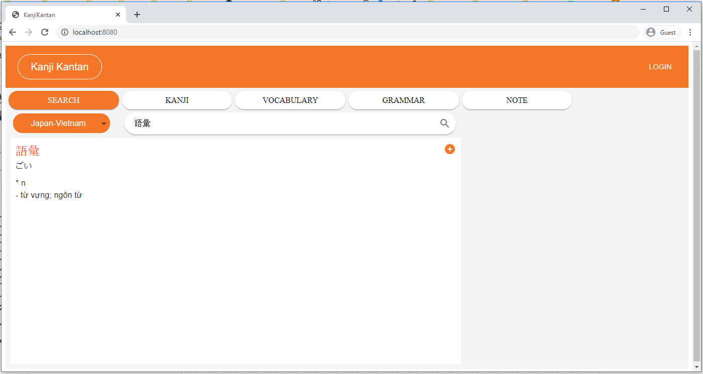
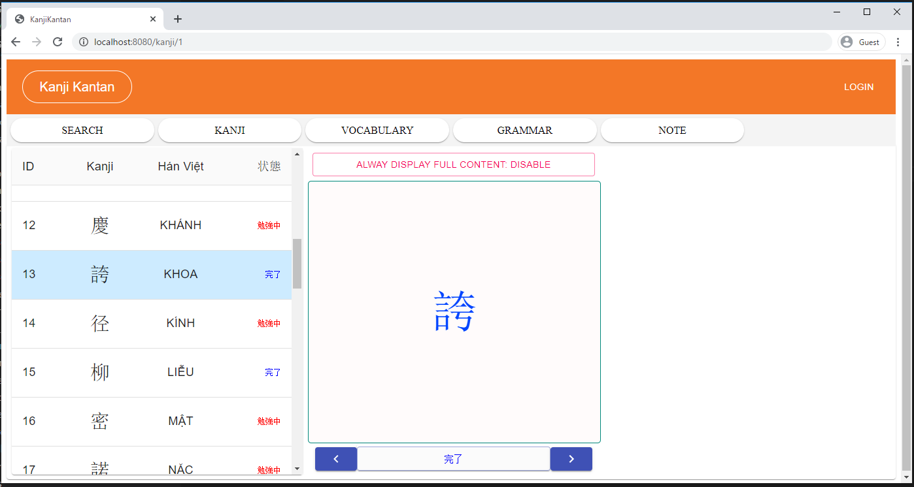
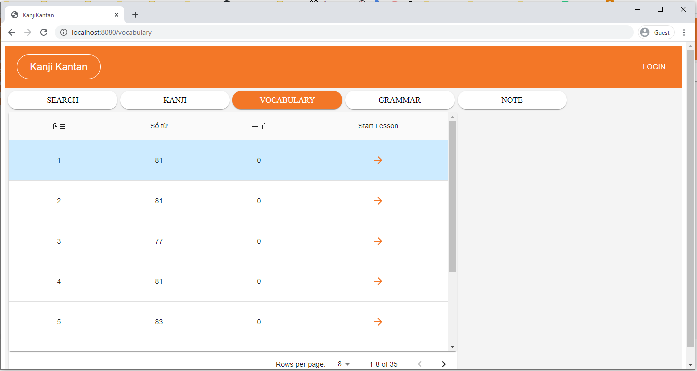
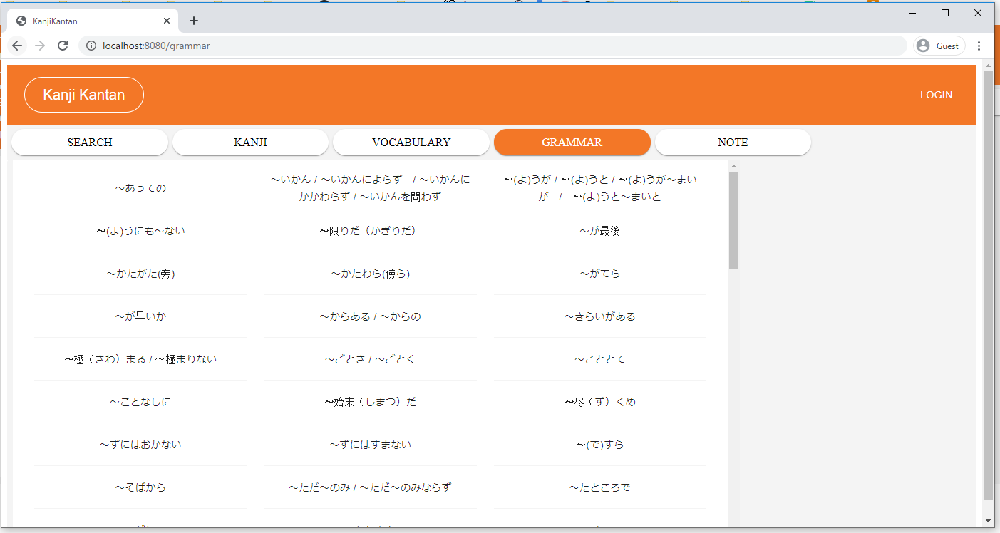
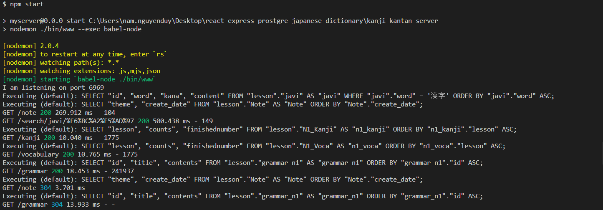

## I. Infra Overview
### 1. Frontend:
- react-js
- webpack
- babel
### 2. Build Frontend
```
cd kanji-kantan-client/
yarn
yarn start
```

### 3. Backend:
- express-js
- sequelize

### 4 Build Backend API
```
cd kanji-kantan-server/
npm install
npm install -g nodemon
npm start
```

### 5. Database:
- postgre

## II. Application Overview
### 1. Overview Screen


### 2. Kanji flag cart


### 3. Vocabulary


### 4. Grammar


### 5. Check logs Express API

